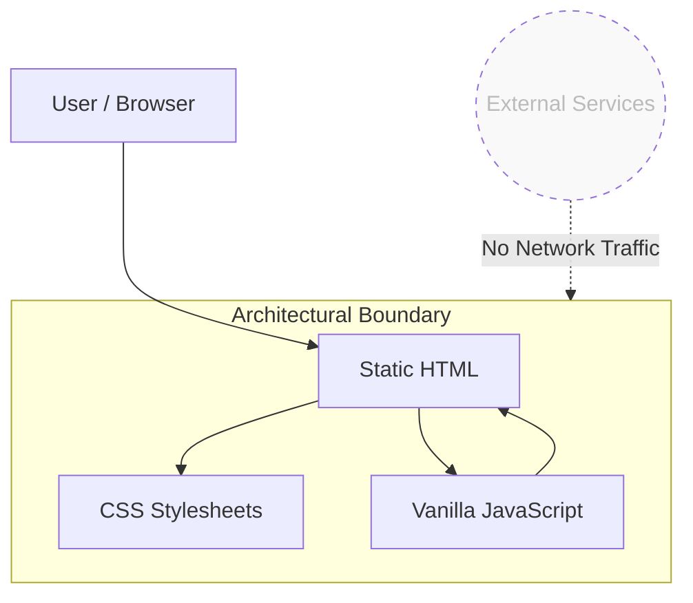

# Static Frontend Website — Security & Architecture Review

## Overview
This project is a documentation-led review of an AI-generated static website, focused on architecture clarity, security reasoning, and decision-making rather than feature delivery. 

The goal is to demonstrate how a **Technical Writer** evaluates, documents, and communicates the behavior of a real system—including its limitations—using clear, structured, and audience-aware documentation. 

> **Note:** This repository intentionally prioritizes analysis, trade-offs, and documentation quality over backend complexity. The documentation *is* the product.

---

## Project Objectives
* **Audit** an AI-generated static frontend for common security and architectural risks.
* **Delineate** frontend vs. backend responsibilities.
* **Demonstrate** decision-making regarding scope, safety, and extensibility.
* **Present** documentation suitable for both technical and non-technical stakeholders.

---

## Intended Audience
This documentation is written for:
* **Technical Writers** and Documentation Specialists.
* **Engineering-adjacent stakeholders** (Product, QA, Support).
* **Hiring managers** evaluating system-level understanding.
* **Beginners** learning how frontend-only systems behave.

---

## System Architecture

### High-Level Design
The application is implemented as a fully static frontend. The following diagram illustrates the contained lifecycle of the application:

## Architectural Rationale

This project is intentionally **static-only**, focusing on client-side interaction. Key decisions include:

* **No backend** – reduces security surface area and simplifies deployment.
* **JavaScript-only interactivity** – all form submissions and interactions are simulated.
* **Explicit limitations** – prevents misleading assumptions about functionality.

## Known Limitations

This project intentionally does not include:

* Data persistence  
* Email storage or delivery  
* Authentication or authorization  
* Spam prevention  
* GDPR or consent management workflows  

These limitations are documented explicitly to avoid misleading assumptions about functionality.

## Backend Considerations (Out of Scope)

Adding a backend would introduce:

* Server-side validation requirements  
* Security responsibilities (CSRF, rate limiting)  
* Data protection and compliance obligations  

**Recommended Approach if Extended:**  
Use a trusted third-party service (e.g., email provider) for forms. Avoid custom backend unless full ownership is necessary. The trade-offs are documented rather than implemented to maintain focus on documentation quality.

## Deployment

The project is suitable for static hosting platforms such as:

* GitHub Pages  
* Netlify  
* Cloudflare Pages  

No build step or environment configuration is required.

## Documentation Approach

This repository demonstrates:

* Clear separation between what the system does and what it deliberately does not do  
* Risk-aware technical communication  
* Architecture documentation written in plain language  
* Decision-driven documentation rather than feature-driven documentation

## What I Would Do Next

If this project were extended beyond documentation scope:

1. Replace simulated form handling with a third-party form or email service.  
2. Add consent and privacy documentation.  
3. Introduce basic monitoring and error reporting.  
4. Expand documentation to include user and maintainer guides.

## Author

**Douglas Ebhoman**  
Technical Writer & Documentation Specialist  
Creative Director, KBD Creative

## Purpose of This Repository

This repository exists as a portfolio case study, demonstrating how a Technical Writer:

* Thinks about systems  
* Communicates technical constraints  
* Documents architectural decisions  
* Bridges the gap between engineering and non-technical audiences  

> **The documentation is the product.**

