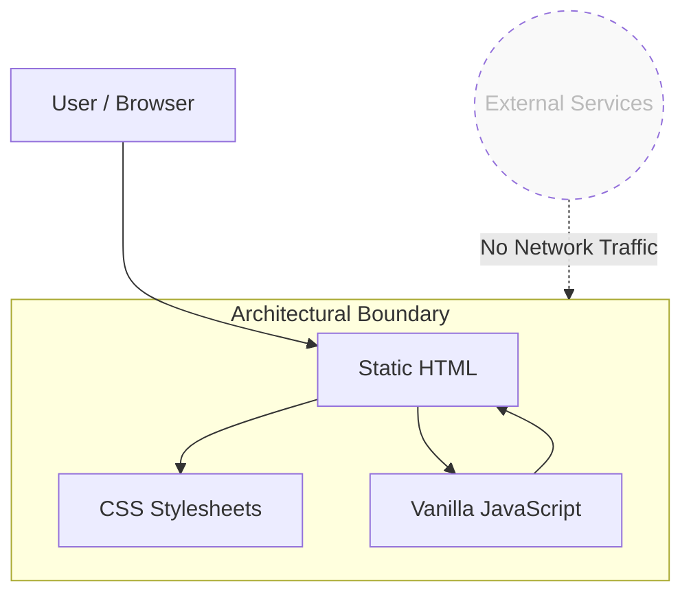

# Static Frontend Website — Security & Architecture Review

## Overview

This project is a documentation-led review of an AI-generated static website, focused on architecture clarity, security reasoning, and decision-making rather than feature delivery.

The goal is to demonstrate how a technical writer evaluates, documents, and communicates the behavior of a real system — including its limitations — using clear, structured, and audience-aware documentation.

> The documentation is the product.

---

## Project Objectives

- Audit an AI-generated static frontend for common security and architectural risks
- Delineate frontend vs. backend responsibilities
- Demonstrate decision-making regarding scope, safety, and extensibility
- Present documentation suitable for both technical and non-technical stakeholders

---

## Intended Audience

This documentation is written for:

- Technical writers and documentation specialists
- Engineering-adjacent stakeholders — product, QA, support
- Hiring managers evaluating system-level understanding
- Developers learning how frontend-only systems behave

---

## System Architecture

### High-Level Design

The application is implemented as a fully static frontend. The following diagram illustrates the contained lifecycle of the application:

```mermaid
graph TD
    User[User / Browser]
    HTML[Static HTML]
    CSS[CSS Stylesheets]
    JS[Vanilla JavaScript]

    User --> HTML
    HTML --> CSS
    HTML --> JS
    JS --> HTML

    subgraph Scope_Boundary [Architectural Boundary]
        HTML
        CSS
        JS
    end

    External((External Services)) -.->|No Network Traffic| Scope_Boundary

    style External stroke-dasharray: 5 5, fill:#f9f9f9, color:#bbb
```

### Architectural Rationale

This project is intentionally static-only, focusing on client-side interaction. Key decisions:

- No backend — reduces security surface area and simplifies deployment
- JavaScript-only interactivity — all form submissions and interactions are simulated
- Explicit limitations — prevents misleading assumptions about functionality

---

## Known Limitations

This project intentionally does not include:

- Data persistence
- Email storage or delivery
- Authentication or authorization
- Spam prevention
- GDPR or consent management workflows

These limitations are documented explicitly to avoid misleading assumptions about functionality.

---

## Backend Considerations

Adding a backend would introduce:

- Server-side validation requirements
- Security responsibilities — CSRF, rate limiting
- Data protection and compliance obligations

If this project were extended, the recommended approach is to use a trusted third-party service for form handling rather than a custom backend, unless full ownership of the data layer is required. The trade-offs are documented here rather than implemented, to maintain focus on documentation quality.

---

## Deployment

Suitable for any static hosting platform — GitHub Pages, Netlify, or Cloudflare Pages. No build step or environment configuration required.

---

## Documentation Approach

This repository demonstrates:

- Clear separation between what the system does and what it deliberately does not do
- Risk-aware technical communication
- Architecture documentation written in plain language
- Decision-driven documentation rather than feature-driven documentation

---

## What I Would Do Next

If this project were extended beyond documentation scope:

1. Replace simulated form handling with a third-party form or email service
2. Add consent and privacy documentation
3. Introduce basic monitoring and error reporting
4. Expand documentation to include user and maintainer guides

---

## Author

**Douglas Ebhoman**
Technical Writer — [douglasebhoman.com](https://douglasebhoman.com)

---

## Purpose

This repository exists as a portfolio case study demonstrating how a technical writer thinks about systems, communicates technical constraints, documents architectural decisions, and bridges the gap between engineering teams and non-technical stakeholders.

> The documentation is the product.
